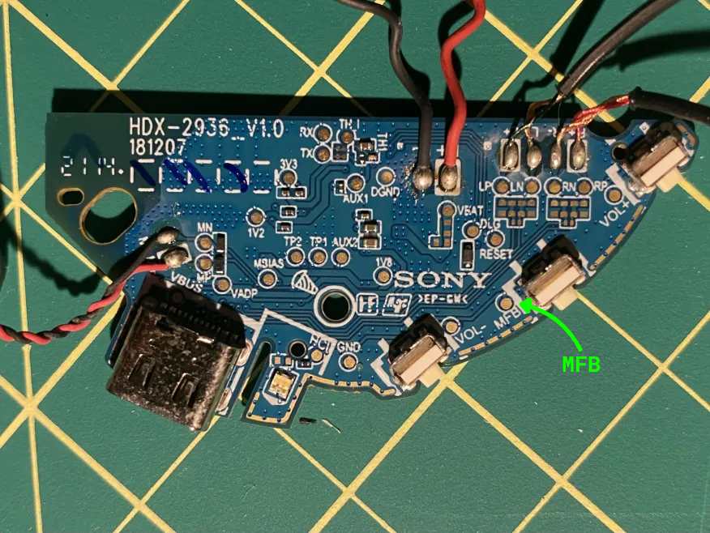
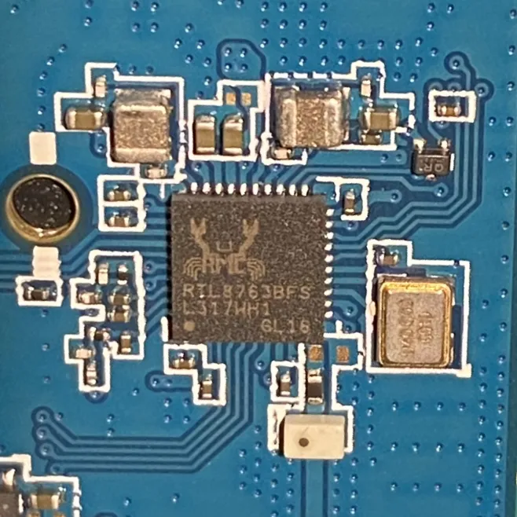
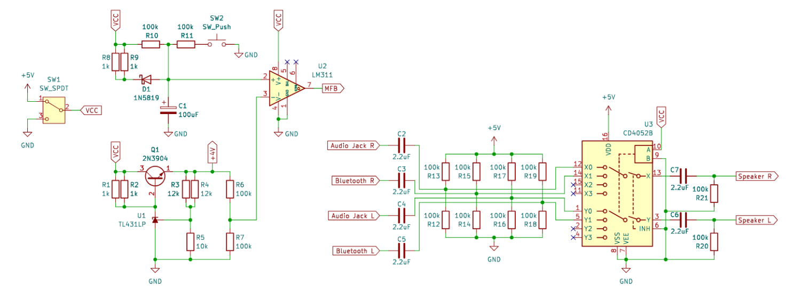
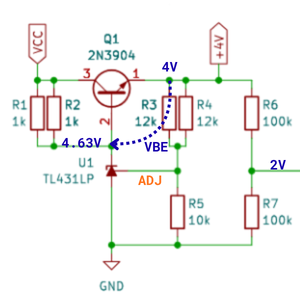
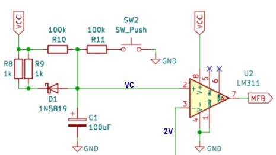
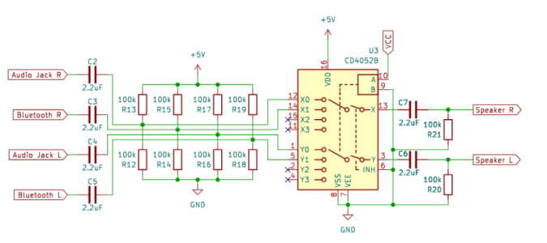
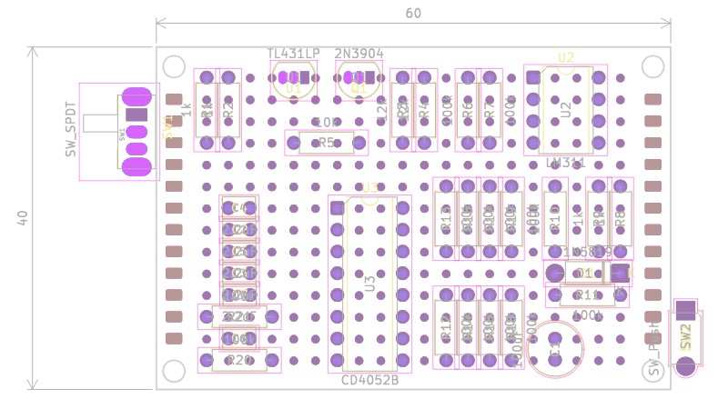
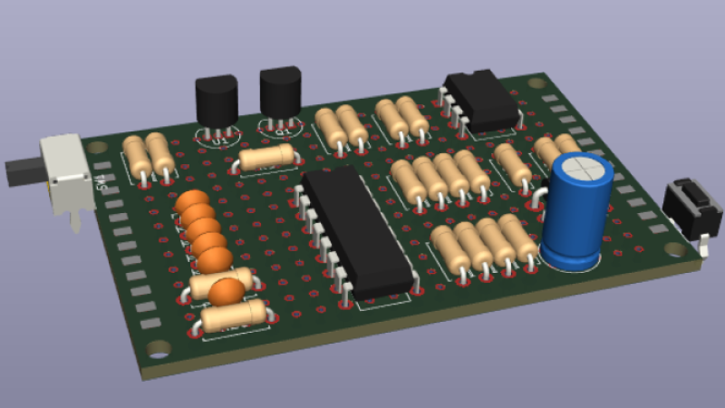
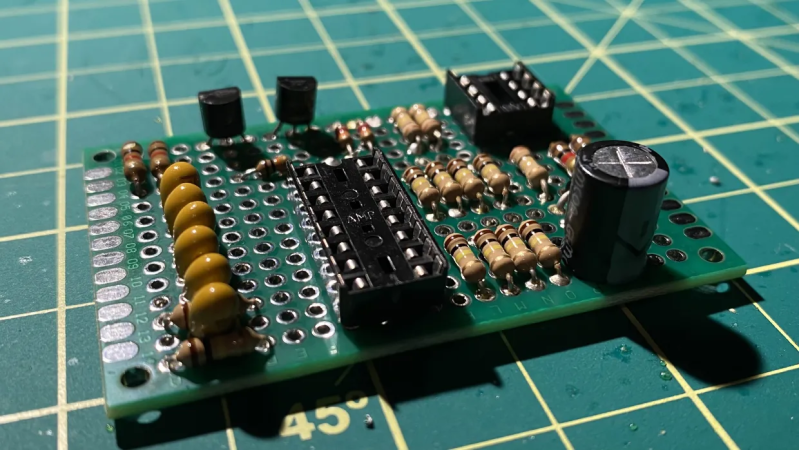
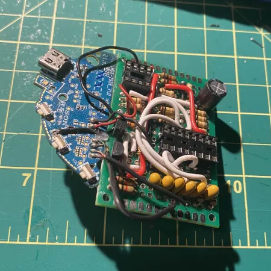

# Bluetooth Speaker Conversion
I had a problem where I could only plug my set of stereo speakers into an outlet across my room. I would either need to run a long aux cord or extension cable to my PC or laptop, and on top of that I wouldnt even be able to play music from my phone since it doesnt have an audio jack.

I took a pair of broken Bluetooth headphones and decided: rather than going to the store and buying a new set of wireless speakers, it would be a fun project to reuse the Bluetooth module from these headphones and create my own.

Using circuit design concepts I learned in University, I was able to create a circuit to add Bluetooth functionality to my speakers. I can now switch between wired and wireless modes, giving me the option to play music from devices without an audio jack.

https://github.com/user-attachments/assets/5ed47675-9274-47a0-8b1d-2a69de63fe11

## Contents

- [**Requirements**](#requirements)
- [**Preliminary**](#preliminary)
- [**Design**](#design)
    - [**Voltage Regulator**](#voltage-regulator)
    - [**RC Timing Circuit**](#rc-timing-circuit)
    - [**Analog Multiplexer**](#analog-multiplexer)
- [**Notes**](#notes)

## Requirements
Before starting this project, I wanted to set some requirements

1. I cannot disable / remove the audio jack since do not want to take away any functionality from my speakers. I must need a way to switch between the wired and Bluetooth inputs.

2. I must use components which I already have on hand or those easily sourceable from my local hobby electronics store.

## Preliminary
The Bluetooth module was extracted from a pair of Sony WCH510 Wireless Headphones which are powered by a 3.7V Li-Ion battery [4.2Vmax]. The module uses a Realtek RTL8763BF series Bluetooth chip, which can operate at a maximum voltage of 4.35V according to the product description. My speakers are powered by a 5V 0.8A DC wall adapter, and since I want to power my circuit from the same supply I will need a way to regulate the 5V input to an appropriate voltage.

With no load connected to the module I observed peak current draws of 7mA, however in my circuit I assume that the module will draw a maximum of 10mA to overcompensate.

|                                                              |                                                            |
|--------------------------------------------------------------|------------------------------------------------------------|
|||
|                                                              |                                                            |

The power button of the headphones connects node `MFB` to ground. While varying the input voltage of the module between 3.7V - 4.2V, `MFB` is measured to be a stable 1.73V and draws around 18uA of current when connected to ground. Taking into account my multimeter inaccuracy, I can assume that `MFB` is pulled up through a 91kOhm resistor to a regulated 1.73V reference. $R = {1.73V \over 18 \mu A} \approx 91k \Omega$

The Bluetooth module has the following functionality:
- If `MFB` is pulled low for at least 2 seconds, the device turns on
- If `MFB` is held low for longer than around 7 seconds, the device goes into pairing mode
- If the headphones are currently on and `MFB` is pulled low for at least 2 seconds again, the device turns off

I want to use a switch to enable wireless mode on my speakers, but the switch cannot short `MFB` to ground directly since that will send the module into pairing mode after 7 seconds. I must create a timing circuit so that when the switch is flipped, it will connect `MFB` to ground for at least 2 seconds but less than 7.

## Design
A SPDT switch is used to choose between the wired and wireless audio inputs by switching VCC of the circuit between 5V and GND. With VCC = 5V the circuit will turn on and the speakers will play Bluetooth audio, with VCC = GND the speakers will only use the wired input. The circuit consists of three major sections: the voltage regulator, the RC timing circuit, and the analog multiplexer which are explained in detail below
|                                    |
|------------------------------------|
||
|                                    |

### Voltage Regulator
I decided to regulate the 5V supply down to 4V to power my circuit since this is within the operating range of my Bluetooth module and will make generating a 2V reference voltage possible for later use. This regulator also needs to be adjustable since 4V is not a common voltage for fixed regulators.

- Linear regulators require a minimum voltage difference between its input and output in order to operate correctly. This is known as the dropout voltage and for standard linear regulators is typically around 3V. Since my desired output voltage is 4V my input would need to be at least 7V which is not possible.
- Switching DC regulators do not have the problem of a dropout voltage, but can produce a lot of electrical noise which is not ideal for this case
- Ideally I would use an adjustable low dropout (LDO) regulator since the dropout can be in the millivolt range. Unfortunately neither I or my local electronics store had variable LDOs in stock, so I was forced to get creative.

I ended up using a TL431 adjustable shunt regulator in an unconventional way. The TL431 is normally used as a shunt voltage reference, however I am using its internal op amp combined with a 2N3904 as a pass transistor to create an improvised variable voltage regulator.

---

|The output voltage of the circuit is controlled by the resistors connected to the `ADJ` pin. $V_O = 2.5(1+{R_{top} \over R_{bot}})$  
$\quad R_{top}=6k\Omega$ and $R_{bot}=10k\Omega \implies V_O = 2.5(1+{R_3 \|\| R_4 \over R_5}) = 2.5(1+{6 \over 10}) = 4V$.  
The TL431 will compare the voltage on the `ADJ` pin to its internal 2.5V reference, and sink the necessary current away from the base of the 2N3904 in order to keep the output at 4V. Since the 2N3904 has a `VBE` of around 0.63V, the voltage at the base will be 4.63V. The TL431 requires at least 0.4mA in order to operate correctly. So by doing a simple analysis to figure out the maximum current that the regulator can supply, we assume that only 0.4mA of current is shunted to ground.  
$\quad I_B = {{5-4.63} \over {500\Omega}} - (0.4 \times 10^{-3}) = 0.34mA$.  
The 2N3904 has a minimum B value of 100  $\quad I_{E\;Max}=(B + 1)I_B = (101)(0.34 \times 10^{-3}) = 34.34mA$  
The regulator, although not nearly as powerful as a commercial voltage regulator, is capable of supplying more then enough current to the Bluetooth module.

---

 

### RC Timing Circuit
I used an LM311 comparator to set the state of node `MFB` and designed a simple RC circuit to meet the timing requirements of the Bluetooth module. When the wireless speaker mode is enabled, VCC will be set to 5V and Bluetooth module will turn on. If switch SW2 is pressed at the same time, the module will go into pairing mode. If the wireless speaker mode is disabled, VCC will be set to ground and will turn the Bluetooth module off.

---

When `VC` < 2V, `MFB` is pulled to ground. When `VC` > 2V, `MFB` is pulled up to 1.73V through the 91kOhm resistor of the Bluetooth module.  
When enabling wireless mode VCC = 5V and SW2 is open, so capacitor C1 is charged through resistor R10.
$\quad \{2s<t_{on}<7s\}$  $\quad t_{on} = -(R_{10})(C_1)ln(1 - {2 \over 5}) = -(100 \times 10^3)(100 \times 10^{-6})ln(1 - {2 \over 5}) = 5.1s$  
When enabling pairing mode VCC = 5V and SW2 is closed, so capacitor C1 is charged through R10 \|\| R11.$\quad\quad \{7s<t_{pair}\}$  $\quad t_{pair} = -(R_{10} \|\| R_{11})(C_1)ln(1 - {2 \over (5/2)}) = -(50 \times 10^3)(100 \times 10^{-6})ln(1 - {2 \over 2.5}) = 8.04s$  
When VCC is set to ground, a 1N5819 schottky diode and two parallel 1kOhm resistors are used to discharge the capacitor.

---

 

### Analog Multiplexer
I used a CD4052 analog multiplexer to switch between the wired and wireless modes of the speaker. When VCC is set to ground, channel 0 is selected which uses the audio jack input. When VCC is set to 5V, channel 1 is selected which uses the Bluetooth input. The audio jack signal voltage is 2Vp-p and the Bluetooth signal voltage is around 1.4Vp-p.

---
> **I know that level shifting the audio signals in this way is a bad idea, please see the Notes section for more details**

The input voltages of the CD4052 cannot exceed the supply voltage range. My audio signals swing both positive and negative so I need to level shift them to be between GND and +5V. Each channel is level shifted +2.5V using two 100kOhm resistors forming a voltage divider, and a 2.2uF capacitor. The output of the multiplexer is re-centered at GND through a 2.2uF decoupling capacitor and single 100kOhm resistor. As a drawback, this configuration forms an RC highpass filter.  
$\quad f_{c\;in} = {1 \over {2 \pi (R_{i \; 1} \|\| R_{i \; 2})C}} = {1 \over {2 \pi (50 \times 10^3)(2.2 \times 10^{-6})}} = 1.44Hz$ $\quad f_{c\;out} = {1 \over {2 \pi (R_o)C}} = {1 \over {2 \pi (100 \times 10^3)(2.2 \times 10^{-6})}} = 0.72Hz$  
Audio frequencies approaching 1.44Hz will be decreased in amplitude as a result.

---

 

https://github.com/user-attachments/assets/cb61ea47-5a1a-4f81-bed7-79674d1ef15c

| | | | |
|-|-|-|-|
|||||
| | | | |

## Notes
This project was a complete success, however there are some things I would like to make note on.

- I am aware that components such as the LM311 and CD4052 are outdated, and newer components are available. My part selection was not ideal since I limited myself to components I already had or those available locally. Tariffs were in effect at the time of this project and I was not willing to accept additional costs on top of shipping for parts online.

- Since I designed this circuit on a perfboard, I was limited to using throughhole components which also affected my part selection. For example, there are a variety of surface mount variable LDOs available. However, ordering a custom PCB online would cost more in shipping than I was willing to pay for this project.

- Instead of my RC circuit, I considered using a dedicated timer IC such as the 555 instead for a more robust design. When the pairing button on the speaker is pressed, the 555 circuit must extend its pulse duration. The resistance applied to its threshold and discharge pins needs to be increased which can be done using a SPDT pushbutton to choose two different resistance values. However, neither I or my local electronics store had a SPDT pushbutton.

- If you replaced the two 12kOhm resistances with a 1kOhm in series with two 10kOhms in parallel, the whole circuit could be created with just 1kOhm, 10kOhm, and 100kOhm resistances. I chose not to do this since I had the 12kOhm resistors laying around, and using them saved space on them perfboard.

- My way of level shifting the audio signals is not ideal for multiple reasons. As mentioned before, I ended up creating a RC highpass filter cutting off frequencies approaching 1.44Hz. While humans can only hear sounds down to the 20Hz range, they are able to *feel* frequencies much lower. If I used this circuit in subwoofers or in a device going into an entire audio system, the bass frequencies would be reduced significantly. RC filters also induce a phase shift in signals approaching the cutoff frequency. I am using 5% tolerance resistors and 10% tolerance capacitors, so the cutoff frequency and phase shift of each channel will differ by some amount. 

- The solution is ether use a dedicated level shifter which uses internal active components to shift the signal with minimal distortion. Unfortunately, most of the components to do this are found online which I was unwilling to order. Alternatively wouldnt have to level shift the signal at all if you powered the multiplexer in dual supply mode. However, this would require a negative voltage rail which I do not have. Rail splitting, Charge pump circuits, and DC-DC converters are not feasible ways to generate a negative rail for this project either.
